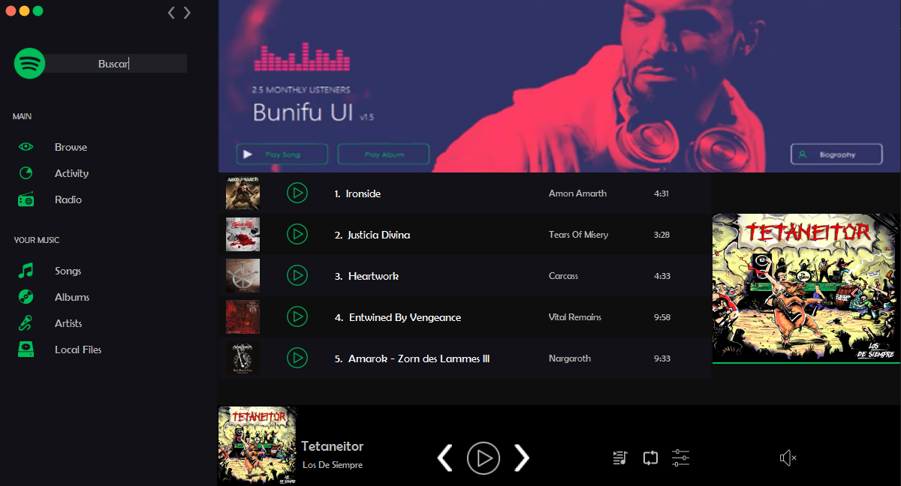

# Actividad 7

Utilizamos reutilización de componentes en sus proyectos para encapsular la lógica y estructura de una plantilla que pueda utilizarse varias veces.

Login

Vista Principal con reutilización de componentes

